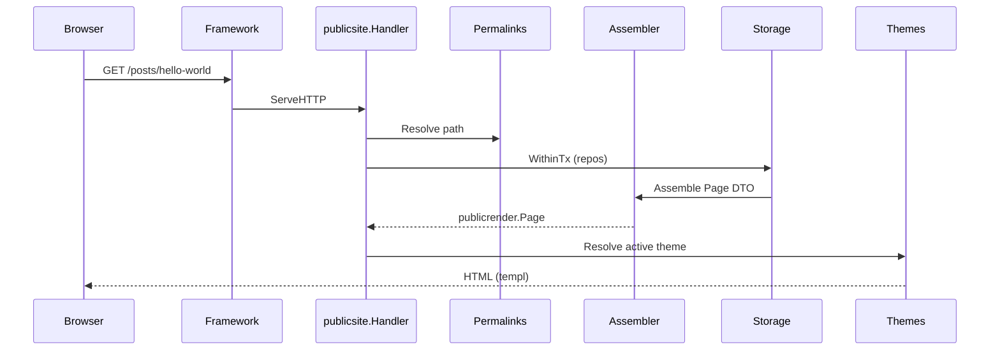
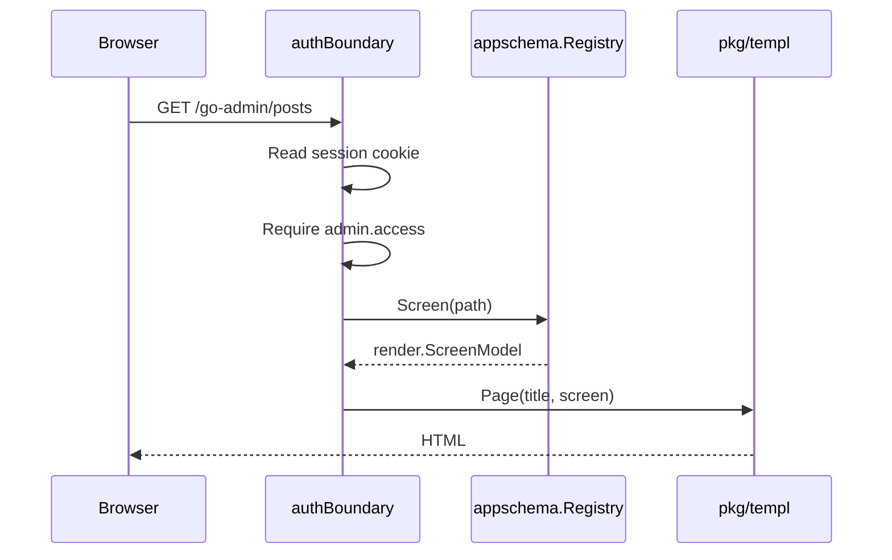
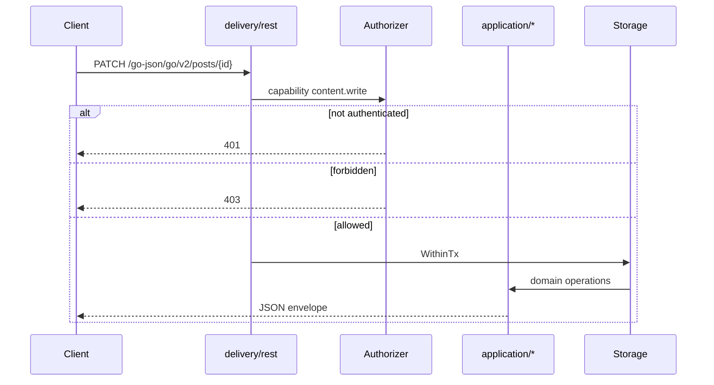

# Request Flow

How HTTP requests move through AppCMS for the three main surfaces: **public**, **admin**, and **REST**.

## Public page (full runtime)



Key packages:

- `internal/delivery/publicsite/handler.go` — gate headless/admin-only modes, system path exclusions
- `internal/permalinks/resolver.go` — home, page slug, post slug patterns
- `internal/delivery/publicsite/assembler.go` — loads content, settings, menus
- `internal/publicrender/model.go` — DTO shared with themes
- `internal/themes` — `blank`, `gocms-default` manifests and views

System paths (`/go-admin`, `/go-json`, `/static`, etc.) return 404 from the public handler so they are not shadowed by slug catch-alls.

## Admin screen



- Login: `/go-login` issues Framework `CookieSession` with `SessionClaims`
- Forms: metadata `action_token` for CSRF-style protection on admin writes
- Screen definitions come from `pkg/module` panel descriptors via `internal/appschema`

## REST mutation



Authorizer is wired from `pkg/app` `authBoundary.Authorize` (session cookie or `Bearer` app token).

## Extension routes (plugins)

After core routes register, `extensionRuntime` activates compiled-in plugins and mounts their routes:

| Plugin | Routes | Auth |
|--------|--------|------|
| `graphql` | `GET/POST /go-graphql` | Public reads filter drafts/private; mutations disabled in baseline |
| `operations` | `/go-json/go/v2/ops/*`, `/go-admin/import-export` | Capability-gated (`admin.access`, `settings.manage`) |

Registration: `internal/extensions/runtime.go` → `RegisterRoutes` with per-route capability checks.

## Framework wrapping

All product routes register on a `http.ServeMux` inside a Framework `Feature`:

```go
frameworkapp.New(cfg).
    WithSecurity(...).
    WithHealthEndpoints(...).
    WithFeature(feature{...}).
    Build()
```

Framework adds middleware (recover, request ID, logging), static file hosting for `/static/`, and process-level health endpoints.
